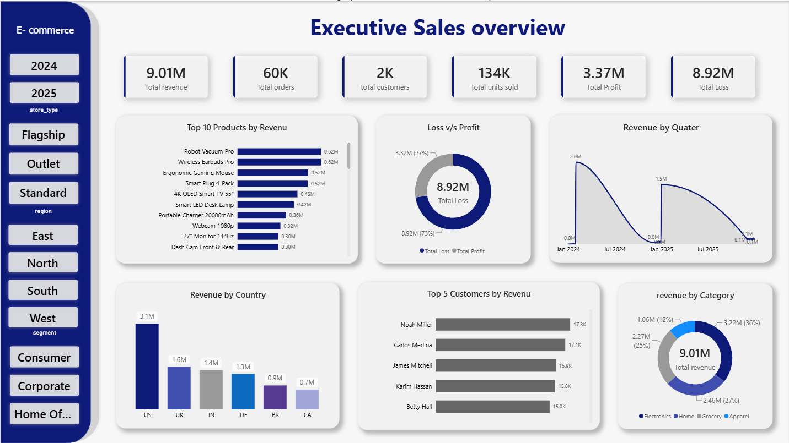
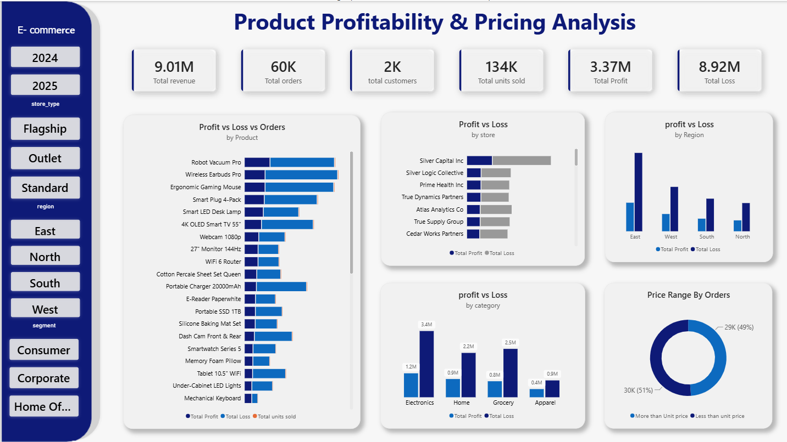
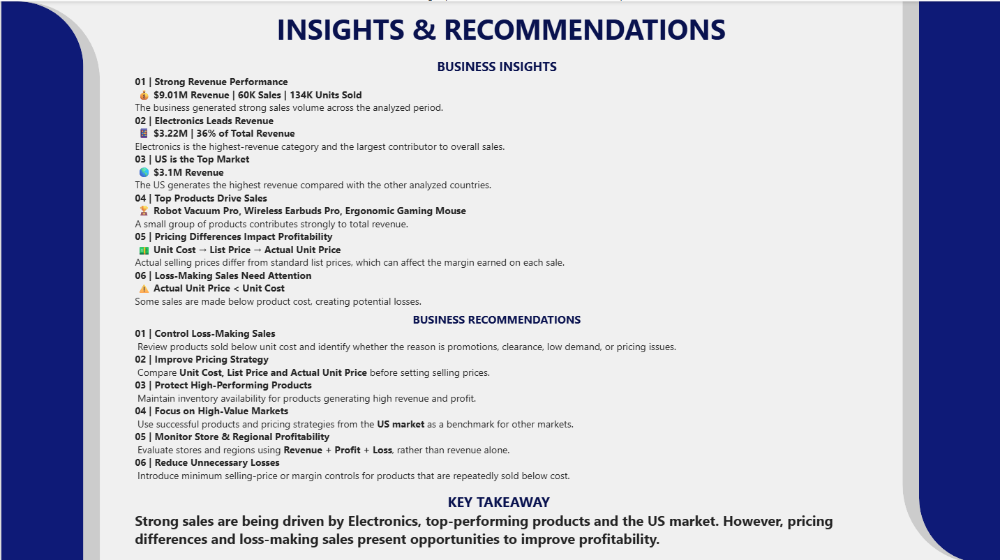

# E-commerce-Sales-Profitability-Pricing-Analysis
E-commerce sales, profitability and pricing analysis using MySQL and Power BI.
## Project Overview

This project analyzes e-commerce sales data to understand sales performance, product profitability, pricing behavior, customer performance, and store and regional performance.

The project uses MySQL for data analysis and Power BI for interactive dashboard development.

The analysis follows an end-to-end data analytics workflow:

Data Preparation → SQL Analysis → KPI Development → Power BI Dashboard → Business Insights → Recommendations

---

## Business Problem

The business wants to understand its sales and profitability performance and identify opportunities to improve pricing and product-level profitability.

The analysis focuses on questions such as:

- Which products generate the highest revenue?
- Which categories and regions contribute the most revenue?
- Which customers generate the highest revenue?
- Which products and stores generate the highest profit?
- Which sales transactions are loss-making?
- How does actual selling price compare with unit cost and list price?
- Which areas require attention to improve profitability?

---

## Dataset

The project contains five related datasets:

- Sales
- Products
- Customers
- Stores
- Dates

The Sales dataset contains approximately 60,000 sales transactions.

The Products dataset contains 400 unique product records identified by unique product keys.

### Pricing Fields

The project uses three different price concepts:

- Unit Cost: The cost associated with the product.
- List Price: The standard listed price of the product.
- Unit Price: The actual selling price recorded for a sales transaction.

These fields are used to analyze pricing differences and potential loss-making transactions.

---

## Tools and Technologies

- MySQL
- Microsoft Excel
- Power BI Desktop
- DAX
- Power Query
- GitHub

---

## Key KPIs

The dashboards track the following KPIs:

- Total Revenue
- Sales Transactions
- Active Customers
- Products Sold
- Total Quantity Sold
- Total Profit
- Profit Margin
- Loss-Making Sales
- Loss-Making Quantity
- Average Unit Price

---

## Dashboard Analysis

### 1. Executive Sales Overview

The first dashboard provides a high-level overview of business performance.

It analyzes:

- Total revenue
- Sales transactions
- Active customers
- Products sold
- Total quantity sold
- Top products by revenue
- Revenue by quarter
- Revenue by country
- Revenue by category
- Top customers by revenue



---

### 2. Product Profitability & Pricing Analysis

The second dashboard focuses on product-level profitability and pricing.

It analyzes:

- Profit and loss by product
- Profit and loss by store
- Profit and loss by region
- Profit and loss by category
- Loss-making sales
- Sales above and below list price
- Unit cost, list price, and actual selling price
- Product-level profitability



---

### 3. Business Insights & Recommendations

The third dashboard summarizes the major findings from the analysis and converts them into practical business recommendations.

The recommendations focus on:

- Pricing
- Profitability
- Product performance
- Market performance
- Store performance
- Regional performance
- Loss-making sales



---

## Key Business Insights

- Electronics is the highest revenue-generating category, contributing approximately 36% of total revenue.
- The US generates the highest revenue among the analyzed countries.
- A small group of products contributes significantly to overall revenue.
- Actual selling prices differ from standard list prices across products.
- Transactions where the actual selling price is below unit cost can create potential losses.
- Store and regional performance varies across revenue and profitability measures.

---

## Business Recommendations

- Review products that are repeatedly sold below unit cost.
- Monitor minimum selling prices and profitability for loss-making products.
- Compare unit cost, list price, and actual selling price when reviewing product pricing.
- Maintain availability of high-performing products.
- Analyze successful products and pricing strategies in high-performing markets.
- Monitor store and regional profitability using both revenue and profit measures.

---

## SQL Analysis

The SQL analysis includes:

- Data exploration
- KPI calculations
- Product analysis
- Customer analysis
- Store analysis
- Regional analysis
- Revenue analysis
- Profitability analysis
- Pricing analysis
- Aggregations
- GROUP BY
- HAVING
- CASE statements
- Subqueries
- Common Table Expressions
- Window functions
- Ranking analysis

The SQL queries are available in:

`ecommerce_analysis_sql.sql`

---

## Power BI Analysis

Power BI was used to create interactive dashboards using:

- Data modeling
- Power Query
- DAX measures
- KPI cards
- Bar charts
- Column charts
- Donut charts
- Slicers
- Filters
- Profitability analysis
- Pricing analysis
- Business insights

The Power BI file is available in:

`ecommerce_sales_analysis.pbix`

---

## Project Structure

```text
ecommerce-sales-profitability-pricing-analysis/
│
├── README.md
│
├── ecommerce_analysis_sql.sql
├── ecommerce_sales_analysis.pbix
│
├── sales_data.csv
├── product_data.csv
├── customer_data.csv
├── store_data.csv
├── date_data.csv
│
├── Executive_Sales_overview.png
├── Product_Profitability_Pricing.png
└── Insights&Recommendations.png

```
## Project Outcome

This project demonstrates an end-to-end data analytics workflow, starting from structured e-commerce datasets and SQL analysis through Power BI dashboard development and business recommendations.

## Author

**Bharath Yadav Pogaku**

## License

This project is licensed under the MIT License.

